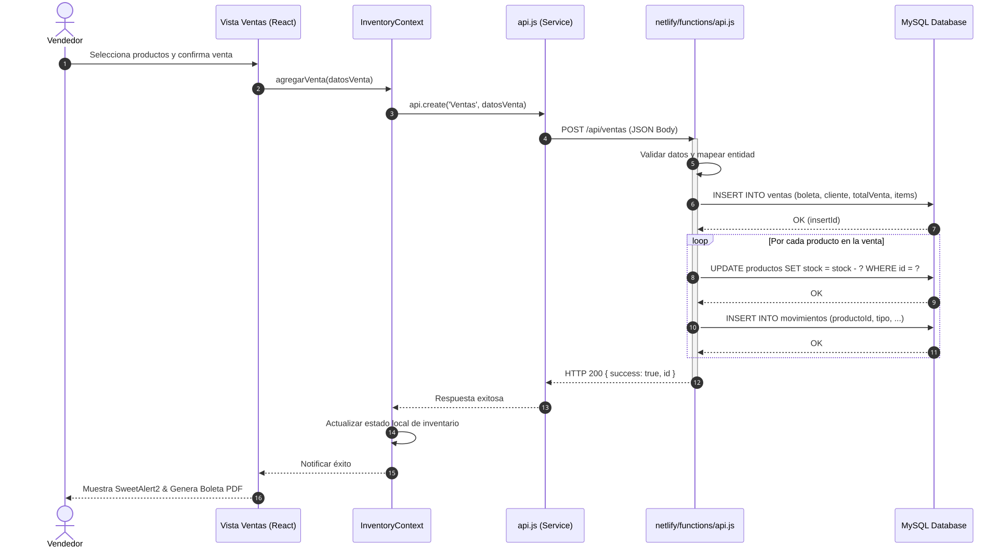

# Documentación Técnica UML - Sistema de Gestión de Inventarios (SGI)

Este documento contiene los diagramas UML para la arquitectura del sistema **SGI - NIZA MOTORS** (React 19, Netlify Serverless y MySQL).

---

## 1. Diagrama de Clases (Domain Class Diagram)

El diagrama de clases describe el modelo de dominio del sistema con sus entidades principales (`Producto`, `Proveedor`, `Marca`, `Categoria`, `Usuario`, `Movimiento`, `Traslado`, `Venta`, `Log`), atributos, tipos de datos y multiplicidad de relaciones.

---

## 2. Diagrama de Componentes (Component Diagram)

Muestra la organización modular del sistema dividida en tres capas principales: Capa de Presentación (React SPA), Capa Backend (Netlify Serverless Functions) y Capa de Persistencia (Base de datos MySQL en Aiven Cloud).

---

## 3. Diagrama de Casos de Uso (Use Case Diagram)

Representa a los actores del sistema (`Administrador` y `Vendedor`) junto con los módulos y casos de uso principales que pueden ejecutar dentro de la aplicación.

---

## 4. Diagrama de Secuencia (Flujo de Registro de Venta)

Modelado paso a paso de la secuencia de llamadas en el proceso de registro de venta, incluyendo la generación de la boleta, la transacción en base de datos y la actualización automática del stock de productos.

---

## 5. Diagrama de Despliegue (Deployment Diagram)

Describe la topología de infraestructura en producción: dispositivos clientes (navegador), CDN y funciones serverless en Netlify Cloud, y el cluster de base de datos MySQL con conexión segura SSL.

